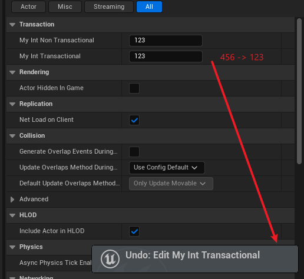

# NonTransactional

- **功能描述：** 对该属性的改变操作，不会被包含进编辑器的Undo/Redo命令中。

- **元数据类型：** bool
- **引擎模块：** Editor
- **作用机制：** 在PropertyFlags中加入[CPF_NonTransactional](../../../../Flags/EPropertyFlags/CPF_NonTransactional.md)
- **常用程度：** ★★

指定该属性的改变，不能在编辑器中通过Ctrl+Z来撤销或Ctrl+Y来重做。在Actor或在BP的Class Defautls都可以生效。

## 测试代码：

```jsx
UCLASS(Blueprintable, BlueprintType)
class INSIDER_API AMyProperty_Transaction :public AActor
{
public:
	GENERATED_BODY()
public:
	UPROPERTY(EditAnywhere, BlueprintReadWrite,NonTransactional,Category = Transaction)
		int32 MyInt_NonTransactional= 123;
	UPROPERTY(EditAnywhere, BlueprintReadWrite,Category = Transaction)
		int32 MyInt_Transactional = 123;
};
```

## 蓝图表现：

在MyInt_Transactional 上可以撤销之前的输入，而MyInt_NonTransactional上的输入无法用Ctrl+Z撤销。



## 行为

在 UE5.8 UHT 中写入 `CPF_NonTransactional`，用于让属性变更不进入编辑器事务/undo 路径。

## UE5.8 审计结论

- 状态：`verified_UE5.8`。
- 结论：已按 UE5.8 源码验证。
- 证据：
  - UE5.8 `UhtPropertyMemberSpecifiers.cs` 对应 specifier 分支
- 批次记录：`references/audits/ue5.8-p0-complete-pass.md`。

## 常见误用

把它当成序列化开关；或用于需要撤销记录的编辑器数据。
