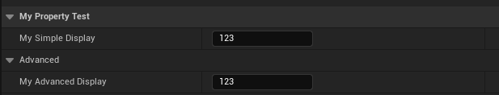

# SimpleDisplay

- **功能描述：** 在细节面板中直接可见，不折叠到高级中。
- **元数据类型：** bool
- **引擎模块：** DetailsPanel, Editor
- **作用机制：** 在PropertyFlags中加入[CPF_SimpleDisplay](../../../../Flags/EPropertyFlags/CPF_SimpleDisplay.md)
- **常用程度：** ★★★

在细节面板中直接可见，不折叠到高级中。

默认情况下本身就是不折叠，但可以用来覆盖掉类上的AdvancedClassDisplay的设置。具体可参见AdvancedClassDisplay的代码和效果。

## 示例代码：

```cpp
UCLASS(Blueprintable, BlueprintType)
class INSIDER_API UMyProperty_Test :public UObject
{
	//PropertyFlags:	CPF_Edit | CPF_ZeroConstructor | CPF_IsPlainOldData | CPF_NoDestructor | CPF_SimpleDisplay | CPF_HasGetValueTypeHash | CPF_NativeAccessSpecifierPublic
	UPROPERTY(EditAnywhere, SimpleDisplay, Category = Display)
		int32 MyInt_SimpleDisplay = 123;

	//PropertyFlags:	CPF_Edit | CPF_ZeroConstructor | CPF_IsPlainOldData | CPF_NoDestructor | CPF_AdvancedDisplay | CPF_HasGetValueTypeHash | CPF_NativeAccessSpecifierPublic
	UPROPERTY(EditAnywhere, AdvancedDisplay, Category = Display)
		int32 MyInt_AdvancedDisplay = 123;
}
```

## 示例效果：



## 原理：

如果有CPF_SimpleDisplay，则bAdvanced =false

```cpp
void FPropertyNode::InitNode(const FPropertyNodeInitParams& InitParams)
{
	// Property is advanced if it is marked advanced or the entire class is advanced and the property not marked as simple
	static const FName Name_AdvancedClassDisplay("AdvancedClassDisplay");
	bool bAdvanced = Property.IsValid() ? ( Property->HasAnyPropertyFlags(CPF_AdvancedDisplay) || ( !Property->HasAnyPropertyFlags( CPF_SimpleDisplay ) && Property->GetOwnerClass() && Property->GetOwnerClass()->GetBoolMetaData(Name_AdvancedClassDisplay) ) ) : false;

}
```

## 行为

在 UE5.8 UHT 中写入 `CPF_SimpleDisplay`，用于 Details Panel 展示优先级/折叠分组语义。

## UE5.8 审计结论

- 状态：`verified_UE5.8`。
- 结论：已按 UE5.8 源码验证。
- 证据：
  - UE5.8 `UhtPropertyMemberSpecifiers.cs` 对应 specifier 分支
- 批次记录：`references/audits/ue5.8-p0-complete-pass.md`。

## 常见误用

以为它改变属性可编辑性；或和 `AdvancedDisplay` 同时表达相反意图。
