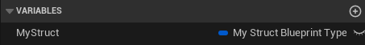

# BlueprintType

- **功能描述：**  允许这个结构在蓝图中声明变量
- **元数据类型：** bool
- **引擎模块：** Blueprint
- **作用机制：** 在Meta中加入[BlueprintType](../../../../Meta/Blueprint/BlueprintType.md)
- **常用程度：★★★★★**

和UCLASS里的一样，可以允许这个结构在蓝图中声明变量

## 示例代码：

```cpp
USTRUCT(BlueprintType)
struct INSIDER_API FMyStruct_BlueprintType
{
	GENERATED_BODY()

	UPROPERTY(BlueprintReadWrite,EditAnywhere)
	float Score;
};

USTRUCT()
struct INSIDER_API FMyStruct_NoBlueprintType
{
	GENERATED_BODY()

	UPROPERTY(EditAnywhere)
	float Score;
};
```

## 测试蓝图：



## 行为

UE5.8 UHT 的默认 `BlueprintType` specifier 写入 `BlueprintType=true` metadata。用于 USTRUCT 时允许结构体作为 Blueprint 类型，并影响 Blueprint-exposed struct member 校验。

## UE5.8 审计结论

- 状态：`verified_UE5.8`。
- 结论：已按 UE5.8 源码验证。
- 证据：
  - UE5.8 `UhtDefaultSpecifiers.cs` `BlueprintTypeSpecifier` writes `BlueprintType` metadata
  - UE5.8 `UhtScriptStruct.cs` checks BlueprintType for Blueprint-exposed struct members
  - 本地样例辅助对照：`D:/github/GitWorkspace/Hello/Source/Insider/Common/InsiderCommonTypes.h`。
- 批次记录：`references/audits/ue5.8-p1-macro-param-struct-enum-pass.md`。

## 常见误用

结构体成员暴露到 Blueprint 但结构体本身未标 `BlueprintType`；或以为它会自动让所有成员可编辑/可读写。
